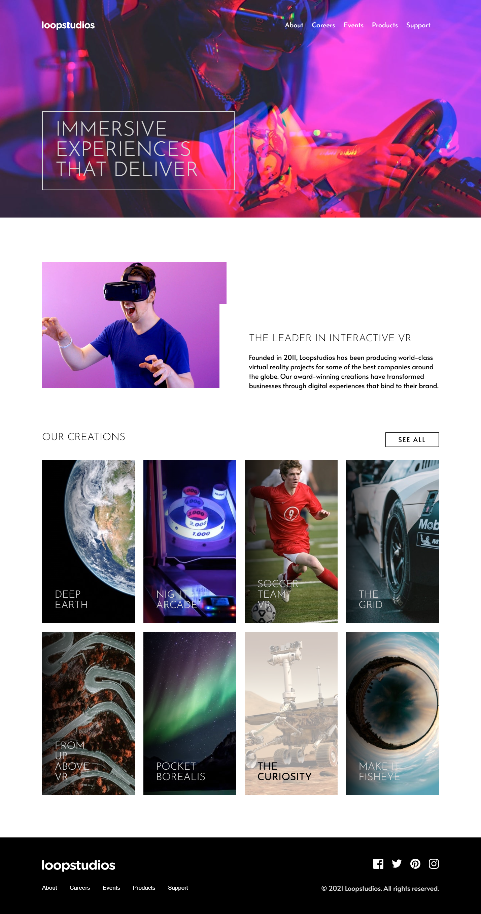

# Frontend Mentor - Loopstudios landing page solution

This is a solution to the [Loopstudios landing page challenge on Frontend Mentor](https://www.frontendmentor.io/challenges/loopstudios-landing-page-N88J5Onjw). Frontend Mentor challenges help you improve your coding skills by building realistic projects.

## Table of contents

- [Overview](#overview)
  - [The challenge](#the-challenge)
  - [Screenshot](#screenshot)
  - [Links](#links)
- [My process](#my-process)
  - [Built with](#built-with)
  - [What I learned](#what-i-learned)
  - [Continued development](#continued-development)
  - [Useful resources](#useful-resources)
- [Author](#author)
- [Acknowledgments](#acknowledgments)

## Overview

### The challenge

Users should be able to:

- View the optimal layout for the site depending on their device's screen size
- See hover states for all interactive elements on the page

### Screenshot



### Links

- Solution URL: https://github.com/DanKRT-Star/loopstudios-landing-page-main
- Live Site URL: [Add live site URL here](https://your-live-site-url.com)

## My process

### Built with

- Semantic HTML5 markup
- CSS custom properties
- Flexbox
- Mobile-first workflow
- Vanilla JavaScript (for mobile menu toggle)

### What I learned

While building this project, I learned how to:

- Structure a responsive landing page using semantic HTML and CSS
- Use CSS custom properties for color and font management
- Implement mobile-first design and media queries for desktop layouts
- Create interactive hover and focus states for navigation and project items
- Use the `<picture>` element for responsive images
- Toggle mobile navigation using JavaScript

Example code:

```html
<picture>
  <source srcset="./images/desktop/image-hero.jpg" media="(min-width: 768px)">
  
</picture>
```

```css
@media screen and (min-width: 768px) {
  header {
    padding: 50px 100px;
  }
  /* ...other desktop styles... */
}
```

### Continued development

In future projects, I want to focus on:

- Improving accessibility for navigation and interactive elements
- Enhancing performance for image loading
- Exploring CSS Grid for more complex layouts

### Useful resources

- [MDN Web Docs - Responsive images](https://developer.mozilla.org/en-US/docs/Learn/HTML/Multimedia_and_embedding/Responsive_images) - Helped me understand how to use the `<picture>` element for responsive images.
- [MDN Web Docs - Media queries](https://developer.mozilla.org/en-US/docs/Web/CSS/Media_Queries/Using_media_queries) - Useful for writing effective media queries.

## Author

- Website - [Add your name here](https://www.your-site.com)
- Frontend Mentor - [@yourusername](https://www.frontendmentor.io/profile/yourusername)
- Twitter - [@yourusername](https://www.twitter.com/yourusername)

## Acknowledgments

Thanks to Frontend Mentor for providing the challenge and resources. Special thanks to the community for feedback and support.
